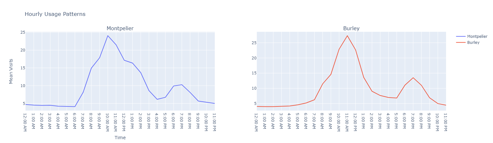

# Temple-Placement-SloppyLions

## Team Names and Majors
| Seth Linares - Computer Science | David Mumford - Computer Science | Jared Linares - Computer Science | Kristin Thumstedter - Computer Science | Brian Anderson - Computer Science

### Our Goal
To find correlations for temple announcements and the establishment of businesses, our team combined the Safegraph pattern data and the census data to observe current operating temple attendance traffic. If there is a trend with certain temples having high usage and then a new temple to help relieve the traffic stress, we could anticipate that the brethren had a higher desire to create another temple in that area. If there are patterns around temples and the economic growth of regions we will be able to use this information to predict locations for future buisness venues. The census data helps to create an estimated distance to the temple and each county's traffic to that particular temple.

### How We Will Use The Data To Meet Our Goal
To meet our goal we will be leveraging data from several sources including Safegraph data, Census data, and Zillow data.

#### Explanation of the current SafeGraph data format and some descriptive visualizations

This is the graph comparing the mean hourly usage patterns of church buildings in Montpelier and Burley from 2019. While the data used to create this graph was collected before the announcement of the temple in either location, it provides a good example of what attendance is like in areas that will have a temple announced some time in the near future. Both have almost identical usage patterns indicating that there could be a non-spurious correlation between mean visits and potential temple announcements.

### Make our Analysis Marketable

Part of our plan for the project is to be able to market our final temple county predictions to specific groups. To do this we want to use some of the features we have engineered to find correlations between temple and these types of organizations. For example, below we have a sample of looking for correlation between the Costco in Boise, ID and the Boise Idaho Temple. These charts are very basic and show a weak correlation currently. We want to look for more concrete evidence during the course of our project to help be able to market our overall Analysis.

We understand that the big ticket item of our analysis is the counties that we think are likely to be locations for our next temples. Yet, what good is that information if we can not convince people that it is important to know?

#### Explanation of the Census data
Census data is a valuable means by which we can understand information about an areas economic standing over time. By making use of census data we can understand how "rich" an area is in terms of resources, both financial as well as material. Understanding these resources and their availability is crucial in helping us to make predictions regarding the placement of businesses, and we will be searching for the correlation with temples as well. By making use of this information it will be possible to understand general patterns in the U.S. About where businesses and temple related business is most likely to succeed, and help us to understand more fully the connection valuable resources play in the establishment of a temple.

### The Costco Conspiracy
Proximity to major retailers, such as Costco, can offer valuable insights into an area's economic vitality. Large retailers often establish locations based on thorough market analyses, ensuring the region's economic health and consumer demand align with their business goals. Following this logic, the presence of such stores may indicate a prospering economic landscape, and the potential of new temples.

The Church of Jesus Christ of Latter-day Saints has historically shown a pattern of establishing temples in economically stable regions (at least in the US & Canada). This observation can be used to hypothesize potential locations for future temples. For instance, examining the locations of existing temples in relation to major retailers can provide valuable insights. As an example of what this might look like, we plotted the geographic coordinates of the existing Rexburg Temple against the newly announced temple in Burley, ID, emphasizing their proximity to prominent retail stores like Costco. In our findings we've found that their distances to major retailers are relatively equidistant (give or take a few miles or kms). This information implies a few key factors including a sizeable population, sizeable member base, and a growing local economy.

We believe that the real estate trends are hugely important indicators of the potential for a region to be given a temple. We have used Zillow's free research data to analyze the growth metrics for all metropolitan areas in the state of Idaho. Although we are admittedly constrained by the limitations of Zillow's public data, our preliminary analysis revealed a consistent pattern the growth trends of metropolitan areas with both existing temples and proposals for new ones. The key takeaway is that these temple regions exhibit substantial YoY% and QoQ% growth. This consistent uptick in real estate values underscores the potential economic vitality of these areas. We are proposing that when predicting which areas will be declared viable as temple sites, the real estate trends should be considered as a key indicator.

### What Constitutes Success

Our team will reach success upon finding correlations between the presence of temples and indicators found in brand attendance data, or census data. We will be able to map presence of these correlations and the most likely locations for future temples and businesses.
